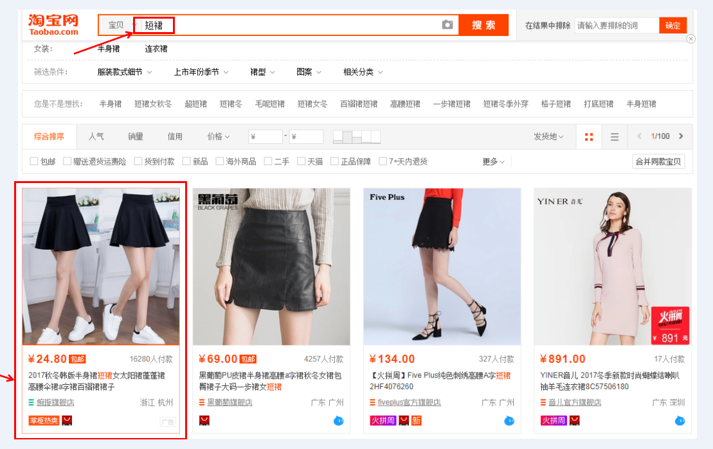
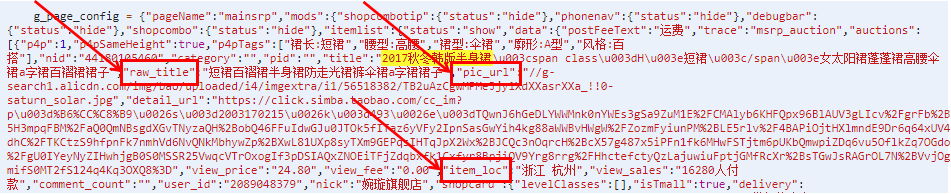

# Python-MySQL 爬虫

抓取淘宝商品标题，并将数据存入Mysql数据库

Python 2.x + Mysql

代码中以关键字"短裙"为例，抓取商品信息：

商品图片、商品名称、淘宝店铺名称、商品价格、运费、商品付款人数、商品评论数(会存在为空值的情况)以及店铺所在城市

网站地址分为两种，每页有44件商品，总共100页：

"https://s.taobao.com/search?q=短裙&imgfile=&js=1&stats_click=search_radio_all%3A1&initiative_id=staobaoz_20171113&ie=utf8"

"https://s.taobao.com/search?q=短裙&imgfile=&js=1&stats_click=search_radio_all%3A1&initiative_id=staobaoz_20171113&ie=utf8&bcoffset=4&ntoffset=4&p4ppushleft=1%2C48&s=44"

找到网页中的数据，获取商品详细内容即可：

无聊写着玩。。。

>个人博客，记录学习、记录生活：

>https://s-top.github.io

